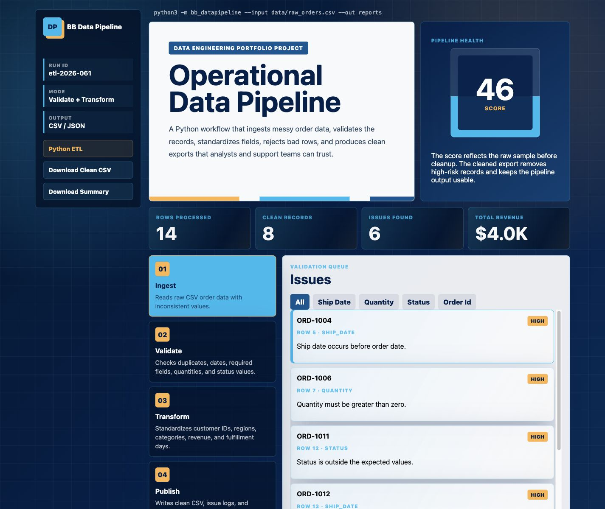

<div align="center">

# 🔧  DataRefinery

**A production-style Python ETL pipeline that cleans, validates, transforms, and reports on messy operational order data.**

[](https://www.python.org/)
[](LICENSE)
[](#running-tests)
[](https://github.com/psf/black)
[](https://briannab1997.github.io/BB-DataPipeline/)

[**Live Demo**](https://briannab1997.github.io/BB-DataPipeline/) · [**Report a Bug**](https://github.com/briannab1997/BB-DataPipeline/issues) · [**Request a Feature**](https://github.com/briannab1997/BB-DataPipeline/issues)

</div>

---

## 📸 Dashboard Preview



The interactive browser dashboard lets you preview a full pipeline run, filter validation issues by severity, inspect transformed records, and download sample output files — all without leaving your browser.

---

## 📋 Table of Contents

- [Project Overview](#-project-overview)
- [Features](#-features)
- [Architecture Overview](#-architecture-overview)
- [Folder Structure](#-folder-structure)
- [Technologies Used](#-technologies-used)
- [Installation](#-installation)
- [How to Run the Project](#-how-to-run-the-project)
- [Running Tests](#-running-tests)
- [Pipeline Output Files](#-pipeline-output-files)
- [Pipeline Validation Rules](#-pipeline-validation-rules)
- [Data Transformations](#-data-transformations)
- [Pipeline Score](#-pipeline-score)
- [Example Output](#-example-output)
- [Future Improvements](#-future-improvements)
- [Contributing](#-contributing)
- [License](#-license)
- [Author](#-author)

---

## 📖 Project Overview

**DataRefinery** is a lightweight, zero-dependency Python ETL (Extract → Transform → Load) pipeline designed as a portfolio project demonstrating practical data engineering skills.

It ingests raw CSV order data, applies a comprehensive set of validation and transformation rules, and produces three structured output reports:

| Output File | Description |
|---|---|
| `clean_orders.csv` | Validated, standardized, enriched order records |
| `pipeline_issues.csv` | Row-level log of every validation failure found |
| `pipeline_summary.json` | Aggregate metrics: revenue, scores, status counts |

**Why this project?**
Most portfolio projects only show *displaying* data. This project demonstrates the harder, more valuable skill: *cleaning and validating* data before it reaches any dashboard, report, or downstream system — which is what real data, analytics, cloud, and operations teams actually spend their time doing.

---

## ✨ Features

- **Validation Engine** — Checks required fields, date formats, numeric ranges, duplicate IDs, status values, and region names
- **Data Standardization** — Normalises region aliases (`NE` → `Northeast`, `se` → `Southeast`), status casings, customer IDs, and category titles
- **Revenue Calculation** — Computes `revenue = quantity × unit_price` for every clean record
- **Fulfillment Timing** — Calculates `fulfillment_days` from order date to ship date
- **Priority Lane Flag** — Marks orders with revenue ≥ $500 or status of "Processing" as `priority_lane: Yes`
- **Severity-based Filtering** — Rows with any `high`-severity issue are rejected; rows with only `medium` issues are kept and flagged
- **Pipeline Score** — Calculates a 0–100 quality score based on issue count and severity
- **Structured Reports** — Exports three output files per run (CSV + JSON)
- **Interactive Browser Demo** — A standalone `index.html` dashboard for visual exploration
- **Unit Tests** — Three focused tests covering summary metrics, data standardization, and file output

---

## 🏗 Architecture Overview

```
                ┌─────────────────────┐
                │   raw_orders.csv    │  ← Input (raw, messy data)
                └────────┬────────────┘
                         │
                         ▼
              ┌──────────────────────┐
              │   _read_csv()        │  EXTRACT — reads CSV rows into dicts
              └──────────┬───────────┘
                         │
                         ▼
              ┌──────────────────────────────────────────┐
              │   run_pipeline()  — per-row processing   │
              │                                          │
              │   1. Required-field validation           │
              │   2. Duplicate order ID detection        │
              │   3. Date format & logic validation      │
              │   4. Numeric range validation            │
              │   5. Status & region standardization     │
              │   6. Row acceptance / rejection          │
              └──────────┬───────────────────────────────┘
                         │
                         ▼
              ┌──────────────────────┐
              │  _transform_row()   │  TRANSFORM — enrich accepted rows
              └──────────┬───────────┘
                         │
                         ▼
              ┌──────────────────────────────────────────┐
              │          write_reports()                 │  LOAD — write outputs
              │                                          │
              │  clean_orders.csv                        │
              │  pipeline_issues.csv                     │
              │  pipeline_summary.json                   │
              └──────────────────────────────────────────┘
```

The pipeline follows a classical **ETL pattern** implemented as pure functions — no classes, no global state, no external dependencies. Each stage is testable in isolation.

---

## 📁 Folder Structure

```text
DataRefinery/
│
├── bb_datapipeline/              # Core Python package (the ETL engine)
│   ├── __init__.py               # Public API: exports run_pipeline, PipelineResult
│   ├── __main__.py               # CLI entry point (python -m bb_datapipeline)
│   └── pipeline.py               # All ETL logic: validate, transform, report
│
├── data/
│   └── raw_orders.csv            # Sample input data (14 rows, intentional errors)
│
├── reports/                      # Generated output files (git-ignored)
│   ├── clean_orders.csv          # 8 accepted, enriched records
│   ├── pipeline_issues.csv       # All validation failures with row references
│   └── pipeline_summary.json    # Aggregate summary with revenue & score
│
├── tests/
│   └── test_pipeline.py          # Unit tests (pytest or unittest)
│
├── assets/
│   └── datapipeline-dashboard.png # Dashboard screenshot for README
│
├── index.html                    # Standalone browser dashboard (no server needed)
├── requirements.txt              # Dev dependencies (pytest, black, ruff, mypy)
├── pyproject.toml                # Project metadata + pytest configuration
├── .gitignore                    # Standard Python gitignore
├── .env.example                  # Environment variable template (if applicable)
├── CHANGELOG.md                  # Version history
├── CONTRIBUTING.md               # Contribution guidelines
├── LICENSE                       # MIT License
└── README.md                     # This file
```

---

## 🛠 Technologies Used

| Technology | Version | Purpose |
|---|---|---|
| **Python** | 3.11+ | Core language |
| `csv` (stdlib) | — | Reading/writing CSV files |
| `json` (stdlib) | — | Writing the summary report |
| `dataclasses` (stdlib) | — | Immutable `PipelineIssue` and `PipelineResult` data containers |
| `decimal` (stdlib) | — | Exact decimal arithmetic for financial values (avoids float rounding) |
| `datetime` (stdlib) | — | Date parsing and fulfillment day calculation |
| `pathlib` (stdlib) | — | Cross-platform file path handling |
| `argparse` (stdlib) | — | CLI argument parsing |
| **HTML / CSS / JS** | — | Interactive browser dashboard (`index.html`) |
| **pytest** | 8.0+ | Test runner (dev dependency) |
| **black** | 24.0+ | Code formatter (dev dependency) |
| **ruff** | 0.4+ | Linter (dev dependency) |
| **mypy** | 1.10+ | Static type checker (dev dependency) |

> **No third-party runtime dependencies.** The pipeline runs on any Python 3.11+ installation with no `pip install` needed.

---

## ⚙️ Installation

### Prerequisites

- **Python 3.11 or higher** — [Download Python](https://www.python.org/downloads/)
- **Git** — [Download Git](https://git-scm.com/)

### Step 1 — Clone the repository

```bash
git clone https://github.com/NiranjanSaravanakumar/DataRefinery.git
cd DataRefinery
```

### Step 2 — Create a virtual environment

**Windows (PowerShell)**
```powershell
python -m venv .venv
.venv\Scripts\Activate.ps1
```

**macOS / Linux**
```bash
python3 -m venv .venv
source .venv/bin/activate
```

### Step 3 — Install development dependencies

```bash
pip install -r requirements.txt
```

> **Note:** The pipeline itself has zero external dependencies. `requirements.txt` only installs developer tools (pytest, black, ruff, mypy).

---

## ▶️ How to Run the Project

### Option A — Run the ETL pipeline (CLI)

```bash
# Windows
python -m bb_datapipeline --input data/raw_orders.csv --out reports

# macOS / Linux
python3 -m bb_datapipeline --input data/raw_orders.csv --out reports
```

**CLI Arguments:**

| Argument | Default | Description |
|---|---|---|
| `--input` | `data/raw_orders.csv` | Path to the raw CSV input file |
| `--out` | `reports` | Directory where output reports will be written |

**Expected terminal output:**
```
Processed 14 rows.
Clean records: 8
Issues found: 18
Pipeline score: 46/100
```

### Option B — Open the browser dashboard

Open `index.html` directly in any modern browser — no server or installation required.

```bash
# Windows
start index.html

# macOS
open index.html

# Linux
xdg-open index.html
```


---

## 🧪 Running Tests

The project includes unit tests covering summary correctness, data standardization, and file output.

**Run with pytest (recommended):**
```bash
pytest
```

**Run with the standard library test runner:**
```bash
# Windows
python -m unittest discover -s tests

# macOS / Linux
python3 -m unittest discover -s tests
```

**Expected result:**
```
...
----------------------------------------------------------------------
Ran 3 tests in 0.012s

OK
```

---

## 📤 Pipeline Output Files

After running the pipeline, three files are written to the `reports/` directory:

### `clean_orders.csv`
Accepted records with added computed fields:

| Column | Description |
|---|---|
| `order_id` | Original order identifier |
| `customer_id` | Uppercased customer identifier |
| `order_date` | ISO 8601 date string |
| `ship_date` | ISO 8601 date string |
| `fulfillment_days` | Days between order and ship date |
| `region` | Standardized region name |
| `category` | Title-cased category |
| `quantity` | Integer quantity |
| `unit_price` | Price formatted to 2 decimal places |
| `revenue` | `quantity × unit_price` |
| `status` | Standardized status label |
| `priority_lane` | `Yes` if revenue ≥ $500 or status is Processing |

### `pipeline_issues.csv`
Row-level validation log:

| Column | Description |
|---|---|
| `row_number` | CSV row number (1-indexed, header = row 1) |
| `order_id` | Affected order ID (or UNKNOWN if missing) |
| `field` | Field that caused the issue |
| `severity` | `high` (row rejected) or `medium` (row kept) |
| `message` | Human-readable description of the problem |

### `pipeline_summary.json`
Aggregate run metrics:

```json
{
  "rows_processed": 14,
  "clean_records": 8,
  "rejected_records": 6,
  "issues_found": 18,
  "high_severity_issues": 13,
  "pipeline_score": 46,
  "total_revenue": "6002.50",
  "revenue_by_region": { ... },
  "status_counts": { ... },
  "top_issue_fields": { ... }
}
```

---

## ✅ Pipeline Validation Rules

| Rule | Severity | Description |
|---|---|---|
| Missing required field | `high` | Any of the 9 required columns is blank |
| Duplicate order ID | `high` | The same `order_id` appears more than once |
| Invalid order date | `high` | `order_date` is not a valid `YYYY-MM-DD` date |
| Invalid ship date | `high` | `ship_date` is not a valid `YYYY-MM-DD` date |
| Ship before order | `high` | `ship_date` is earlier than `order_date` |
| Non-positive quantity | `high` | `quantity` is 0 or negative |
| Non-positive unit price | `high` | `unit_price` is 0 or negative |
| Invalid status | `high` | `status` is not one of the 5 accepted values |
| Unrecognised region | `medium` | `region` cannot be mapped to a standard name |

> Rows with **any** `high`-severity issue are excluded from `clean_orders.csv`. Rows with only `medium`-severity issues are included.

---

## 🔄 Data Transformations

| Field | Transformation Applied |
|---|---|
| `customer_id` | Converted to uppercase (e.g., `c-224` → `C-224`) |
| `region` | Alias-mapped (e.g., `NE`, `north east` → `Northeast`) |
| `status` | Normalised to title case (e.g., `shipped` → `Shipped`) |
| `category` | Title-cased (e.g., `cloud services` → `Cloud Services`) |
| `unit_price` | Currency symbol stripped, formatted to 2 d.p. |
| `revenue` | Computed as `quantity × unit_price` |
| `fulfillment_days` | Computed as `ship_date − order_date` in calendar days |
| `priority_lane` | Set to `Yes` if revenue ≥ 500 or status is Processing |

---

## 📊 Pipeline Score

The **Pipeline Score** is a 0–100 quality metric computed at the end of each run:

```
score = max(0, min(100, 100 − (issues × 4) − (high_severity_issues × 5)))
```

| Score Range | Interpretation |
|---|---|
| 90 – 100 | Excellent data quality |
| 70 – 89 | Good — minor issues present |
| 50 – 69 | Fair — significant cleanup needed |
| 0 – 49 | Poor — major data quality problems |

The sample dataset intentionally scores **46/100** to demonstrate the pipeline's issue-detection capability.

---

## 💡 Future Improvements

- [ ] Add support for Excel (`.xlsx`) input files via `openpyxl`
- [ ] Add a configurable rules file (JSON/YAML) so validation rules can be changed without editing source code
- [ ] Extend region aliases to support all US regions and international markets
- [ ] Add a `--verbose` CLI flag for detailed per-row output
- [ ] Introduce a `--dry-run` flag to validate without writing output files
- [ ] Add GitHub Actions CI workflow to run tests automatically on every push
- [ ] Package and publish to PyPI for easy installation
- [ ] Add Dockerfile for containerised execution

---

## 🤝 Contributing

Contributions are welcome! See [CONTRIBUTING.md](CONTRIBUTING.md) for guidelines.

1. Fork the repository
2. Create a feature branch: `git checkout -b feature/your-feature-name`
3. Make your changes and add tests
4. Run the test suite: `pytest`
5. Commit: `git commit -m "feat: add your feature"`
6. Push: `git push origin feature/your-feature-name`
7. Open a Pull Request

---

## 📜 License

Distributed under the **MIT License**. See [LICENSE](LICENSE) for full details.

---

## 👤 Author

**Brianna B.**

- GitHub: [@briannab1997](https://github.com/briannab1997)
- Live Demo: [briannab1997.github.io/BB-DataPipeline](https://briannab1997.github.io/BB-DataPipeline/)

---

<div align="center">

⭐ **If this project was useful to you, please consider starring the repository!** ⭐

</div>
